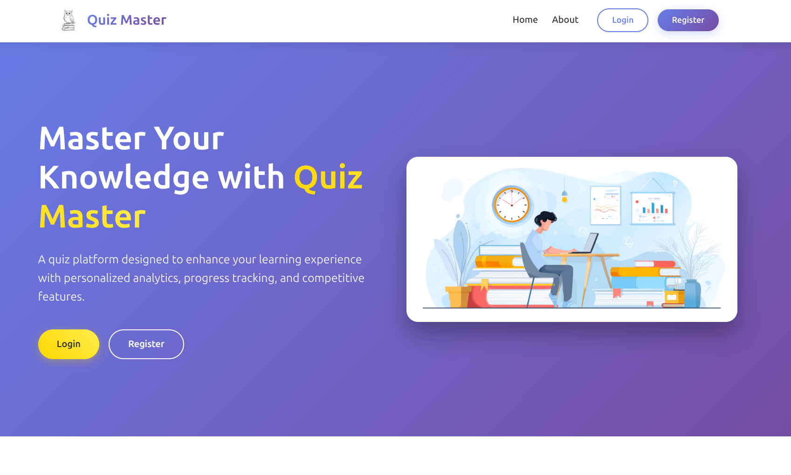
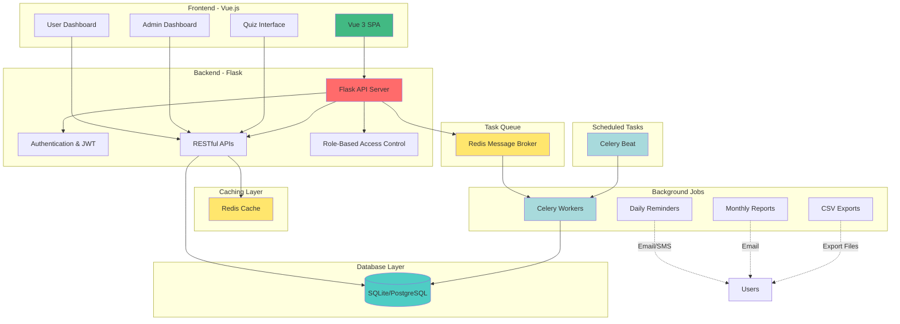
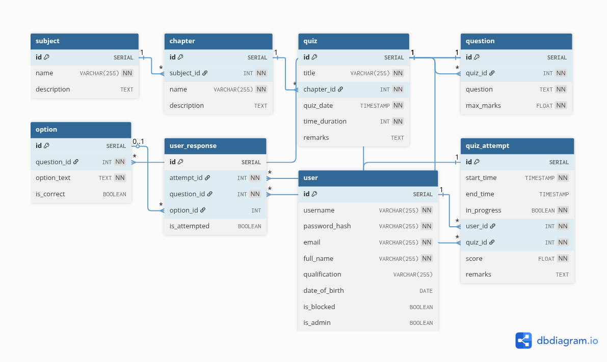

# Quiz Master

## About This Project

This project was developed as part of **Modern Application Development II (MAD-II)** coursework in the **IIT Madras BS Degree Program in Data Science and Applications**. It demonstrates a full-stack web application with authentication, role-based access control, background jobs, caching, and scheduled tasks.

Quiz Master is a multi-user quiz preparation platform that allows an administrator to create subjects, chapters, and quizzes, while users can participate in quizzes and track their performance over time.



## How to Run

### Prerequisites
- Docker and Docker Compose installed on your system

### Steps

1. **Clone the repository**
   ```bash
   git clone <repository-url>
   cd quizmaster
   ```

2. **Build and start the application**
   ```bash
   docker-compose up --build
   ```
   This will start all services (backend, frontend, database, Redis, Celery workers, and Celery Beat scheduler)

3. **Access the application**
   - Open your browser and navigate to **`http://localhost:5173`**

4. **Login with admin credentials**
   - Username: `admin`
   - Password: `admin123`

5. **Seed dummy data (recommended for testing)**
   ```bash
   docker-compose exec backend python scripts/seed_data.py
   ```
   This populates the database with sample subjects, chapters, quizzes, questions, and user data.

## Architecture Overview



## Database Schema

The application uses a relational database with the following schema:



### Key Entities:
- **User**: Stores user information with role-based access (is_admin flag)
- **Subject**: Top-level course categories
- **Chapter**: Subdivisions within subjects
- **Quiz**: Timed assessments linked to chapters
- **Question**: MCQ questions belonging to quizzes
- **Option**: Answer choices for questions
- **Quiz_Attempt**: Tracks user quiz sessions
- **User_Response**: Records individual question answers

## What's Implemented

### Core Features
- ✅ **User Authentication & Authorization** - JWT token-based authentication with role-based access control
- ✅ **Admin Dashboard** - Complete CRUD operations for subjects, chapters, quizzes, and questions
- ✅ **User Dashboard** - Quiz participation, performance tracking, and analytics
- ✅ **Timed Quizzes** - Real-time countdown timer with auto-submission
- ✅ **Performance Analytics** - Visual charts and statistics for both users and admins
- ✅ **Search Functionality** - Search across users, subjects, and quizzes

### Background Jobs & Automation
- ✅ **Daily Reminders** - Celery Beat scheduled job to notify inactive users via email
- ✅ **Monthly Activity Reports** - Automated HTML email reports with quiz statistics
- ✅ **CSV Export** - Asynchronous export of user quiz data and admin analytics
- ✅ **Redis Caching** - Performance optimization for frequently accessed data

### Technology Stack
- **Frontend**: Vue 3, Vue Router, Pinia (State Management), Chart.js, Axios
- **Backend**: Flask, Flask-JWT-Extended, Flask-CORS, SQLAlchemy ORM
- **Database**: SQLite (development) / PostgreSQL (production-ready)
- **Task Queue**: Celery with Redis as message broker
- **Scheduler**: Celery Beat for periodic tasks
- **Caching**: Redis
- **Email**: SMTP integration for notifications
- **Containerization**: Docker & Docker Compose

## Roles

1. **Admin**
- Admin is also known as the quiz master
- There is only one admin to this application
- The administrator login redirects to the quiz master/admin dashboard
- The administrator will manage all the other users
- The administrator will create a new subject, add various chapters under a subject, add quiz questions under a chapter.

2. **User**
- User Register and Login
- Each user may have:
    id , Username (email), Password, Full Name, Qualification, DOB 
- Choose the subject/chapter name -- participate in the quiz and  View the quiz scores.

## Terminologies

**User**: The user will register and login and attempt any quiz of his/her interest.

**Admin**: The superuser with full control over other users and data. Registration is not allowed for the admin: The admin account must pre-exist in the database when the application is initialized.

**Subject**: The field of study in which the user wishes to give the quiz. The admin will be creating one or many subjects in the application. Every subject can possible have the following fields: id, name, description, etc,..

**Chapter**: Each subject can be subdivided into multiple modules called chapters. The possible fields of a chapter can be the following: id, name, description, etc,.

**Quiz**: A quiz is a test that is used to evaluate the user’s understanding of any particular chapter of any particular subject. A test may contain the following attributes: id, chapter_id, date_of_qiz, time_duration, remarks etc..

**Questions**: Every quiz will have a set of questions created by the admin. Possible fields for a question include: id, quiz_id, question, option1, option2, option3, option4, correct_option, marks, etc.

**Scores**: Stores the scores and details of a user's quiz attempt. Possible fields for scores include: id, user_id, quiz_id, score, remarks, time_stamp_of_attempt etc.


## **Core Functionalities**

### 1. **Authentication**
- **Admin and User Login/Register**:  
  - A form with fields like username and password for user and admin login.
  - The application should have only one admin identified by its role.
  - **Authentication Options**:
    - Flask security (session or token-based).
    - JWT token-based authentication for role-based access control.
  - A suitable model is required to store and differentiate all types of users.

---

### 2. **Admin Dashboard**  
Accessible only by the admin. The following functionalities are available:
- **Subject Management**:  
  - Create/Edit/Delete subjects.
- **Chapter Management**:  
  - Create/Edit/Delete chapters under a subject.
- **Quiz Management**:  
  - Create/Edit/Delete quizzes under a chapter.
  - Add a set of multiple-choice questions (MCQs) to quizzes (only one correct option per question).
- **Search Functionality**:  
  - Search users, subjects, and quizzes.
- **Summary Charts**:  
  - Display visual summary data for quizzes and users.

---

### 3. **Quiz Management (Admin-Specific)**
- **Quiz Details**:
  - Specify the quiz date and duration (HH:MM format).
- **Question Management**:
  - Create/Edit/Delete MCQs for specific quizzes.

---

### 4. **User Dashboard**
Accessible only by users. The following functionalities are available:
- **Quiz Participation**:  
  - Users can attempt any quiz of interest.
  - Quizzes are timed, and the user's score is recorded upon submission.
- **Performance Tracking**:  
  - View past quiz attempts with scores.
  - Access visualized performance data (summary charts).

**Note**: The database must be created programmatically through table creation or model code. Manual database creation is not allowed.

---

## **Backend Jobs**

### **a. Scheduled Job - Daily Reminders**
- **Purpose**:
  - Notify users if they haven't visited the platform or if a new quiz is created by the admin.
- **Delivery Options**:
  - Google Chat Webhooks, SMS, or Email.
- **Timing**:
  - Daily in the evening (users can choose the time).

---

### **b. Scheduled Job - Monthly Activity Report**
- **Purpose**:  
  Generate and email a monthly activity report to users.  
- **Content**:  
  - Quiz details, number of quizzes attempted, scores, average score, rankings, etc.
- **Process**:
  - Trigger the job on the first day of each month.
  - Create and send the report in HTML format via email.

---

### **c. User-Triggered Async Jobs**

#### **Option 1: Export User Quiz Data (CSV)**
- **Purpose**:  
  Allow users to export completed quiz details in CSV format.
- **Content**:  
  - Quiz details like `quiz_id`, `chapter_id`, `date_of_quiz`, `score`, `remarks`, etc.
- **Process**:
  - Users trigger the export from their dashboard.
  - A batch job is initiated, and the user is alerted upon completion.

#### **Option 2: Export Admin Data (CSV)**
- **Purpose**:  
  Allow admins to export quiz-related user data in CSV format.
- **Content**:  
  - User details like `user_id`, `quizzes_taken`, `average_score`, etc.
- **Process**:
  - Admins trigger the export from their dashboard.
  - A batch job is initiated, and the admin is alerted upon completion.

---

## **Performance and Caching**
- **Caching**:
  - Implement caching to improve API performance.
  - Add cache expiry mechanisms to maintain data consistency.

---
